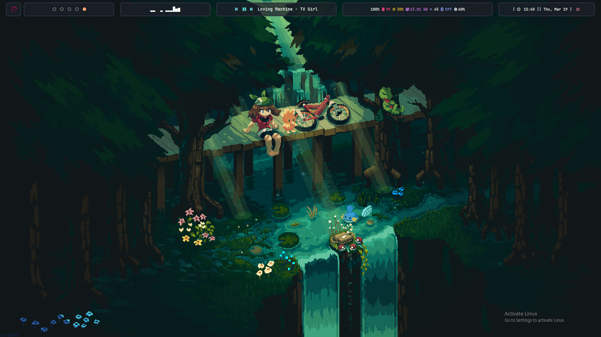
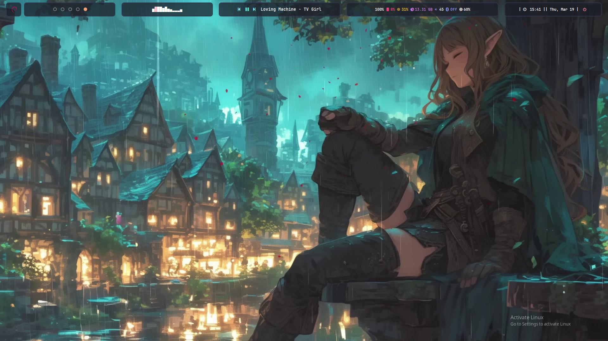
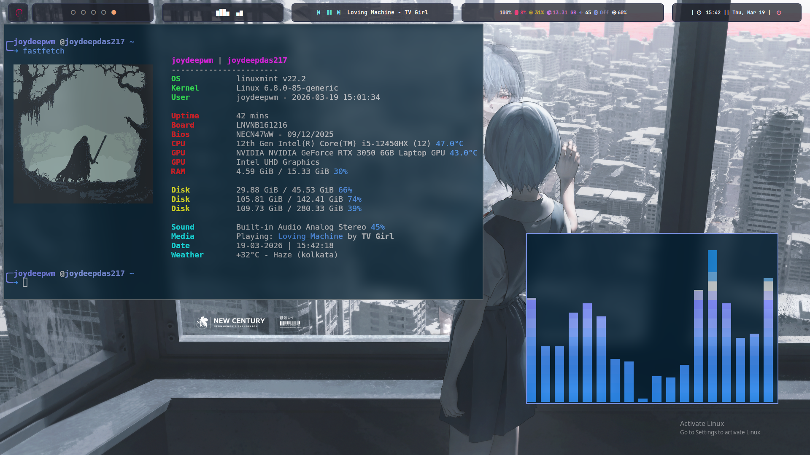
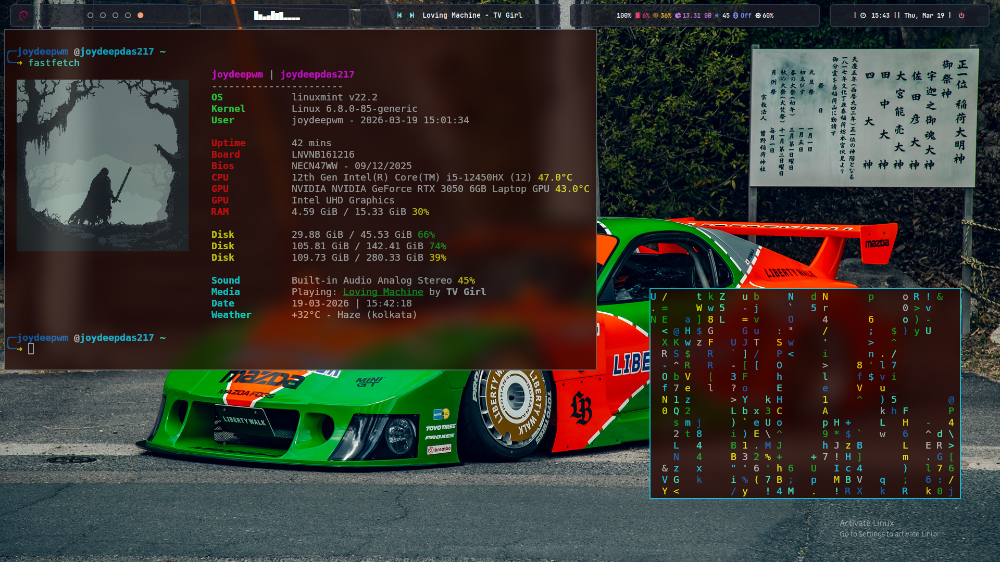
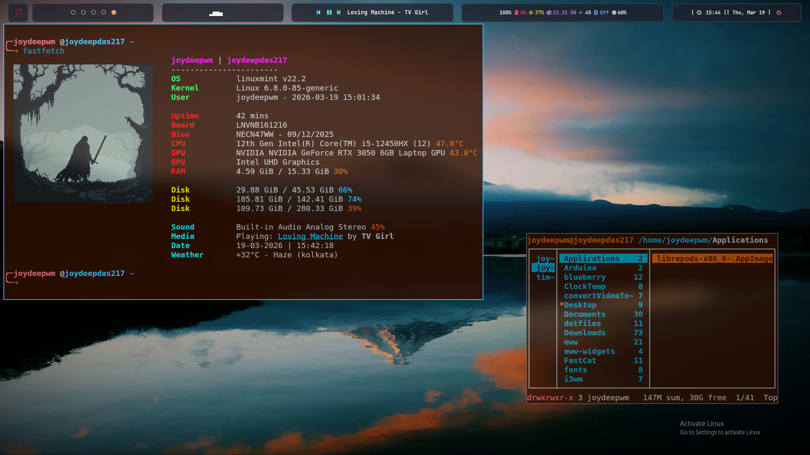
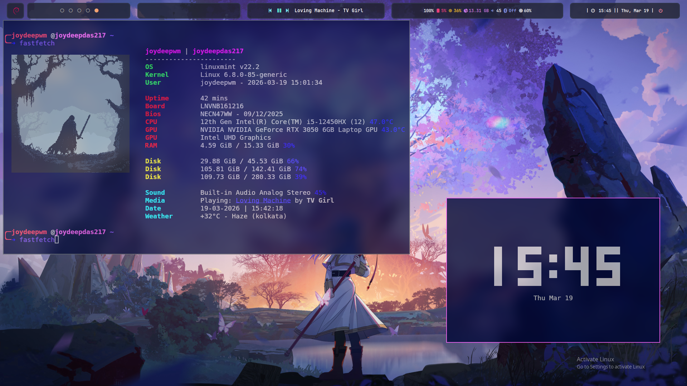

###Personal i3wm dotfiles 
I'll be trying to move to wayland and switch from mint to another distribution.
This was my first rice so just uploading it here

## System Information
* **Hardware:** Lenovo LOQ 15IAX9
* **CPU:** Intel Core i5-12450HX
* **GPU:** Nvidia RTX 3050 (6GB)
* **OS:** Linux Mint 22.2
* **Window Manager:** i3wm
* **Compositor:** Picom
* **Terminal:** Kitty
* **Launcher:** Rofi
* **Bar:** Polybar

